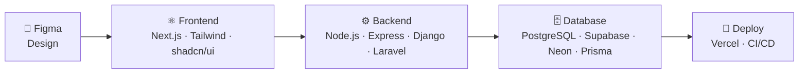

<!-- ═══════════════ HEADER ═══════════════ -->
<div align="center">


<a href="https://git.io/typing-svg">
  
</a>

<br/>

[](https://ianne-portfolio.vercel.app/)
[](https://linkedin.com/in/ianne-carl-bulilan-321421349)
[](mailto:bulilaniannecarl@gmail.com)


</div>

<!-- ═══════════════ ABOUT ═══════════════ -->

## `~/about`

```ts
const ianne = {
  name: "Ianne Carl Z. Bulilan",
  role: "Full-Stack Web Developer",
  currently: "Full-Stack Developer @ KPVE (Remote)",
  based: "Leyte, Philippines 🇵🇭",
  education: "BSIT — AMA Computer Learning Center (2025)",
  strongestAt: ["Next.js", "Tailwind CSS", "Node.js"],
  database: ["PostgreSQL", "Supabase", "Neon", "Prisma", "MongoDB"],
  workflow: "Figma → Frontend → Backend + DB → Vercel",
  exploring: ["Agentic AI orchestration", "CLI-driven AI workflows", "Backend optimization"],
  openTo: ["Recruitment & full-time roles", "Freelance projects", "Collaborations"],
} as const;
```

<!-- ═══════════════ WORKFLOW ═══════════════ -->

## 🔁 How I Build

I take a website from **design file to production** on my own: pixel-accurate frontend, the API behind it, the database underneath, and the deploy.



**Websites I build:** landing pages · e-commerce & storefronts · portfolios · SaaS apps · CRMs & dashboards · booking systems · AI chatbots · component libraries

<!-- ═══════════════ PROJECTS ═══════════════ -->

## 🚀 Featured Projects

| Project | What it does | Built with | Links |
|---|---|---|---|
| **🧩 SnapJSX** | Minimalist, high-performance JSX component library with a root-level architecture built for rapid integration and agentic enablement | `Next.js` `TypeScript` `Tailwind` `CLI AI Agents` | [Live](https://snapjsx.vercel.app/) |
| **📄 BriefCV** | AI-powered resume builder that optimizes profiles for ATS alignment and market impact; dual-token JWT rotation with Google OAuth | `Next.js 15` `TypeScript` `MongoDB` `Zustand` `OAuth 2.0` | [Live](https://briefcv.vercel.app/) |
| **🐛 Theebug** | VS Code-styled, drag-and-drop coding game — fix broken code across 7 language tracks with difficulty-weighted scoring, a GitHub OAuth leaderboard and an AI mascot coach | `Full-Stack` `GitHub OAuth` `AI Coaching` | — |
| **🏝️ TourConnect** | Travel platform with hotel booking, role-based access, JWT (access + refresh) and an AI chatbot *(Capstone)* | `Next.js` `Express` `MongoDB` `shadcn/ui` | — |
| **🚐 TourVan** | Cloud-based van tour booking with real-time GPS, seat tracking and location autocomplete *(Capstone)* | `React` `Node.js` `MongoDB` `Leaflet.js` | — |
| **🧠 DepHelp** | Assessment platform with Google auth, dynamic questionnaires, real-time scoring and personalized results | `Next.js` `NextAuth` `Mongoose` `Tailwind` | — |

<!-- ═══════════════ CURRENT ═══════════════ -->

## 💼 Currently

**Full-Stack Developer @ KPVE** · *Jun 2026 – Present · Remote*

Building a large multi-portal web platform (Laravel + Next.js on Vercel & Railway), plus client landing pages and CRMs on the side.

| | What I've shipped |
|---|---|
| 💳 | Booking flows with **Stripe** payments and automated **Zoom** meeting provisioning |
| 🔌 | Government and third-party **API integrations** (Medicare Online, PRODA) |
| 🗂️ | Staff dashboard / CRM with PDF generation and a **WebSocket** real-time messenger |
| 🔐 | Role-based access control across **4 portals**: patient · doctor · staff · admin |

<!-- ═══════════════ TIMELINE ═══════════════ -->

## 🧭 Journey


<details>
<summary><b>📂 Experience details</b> (click to expand)</summary>
<br/>

**Full-Stack Developer — KPVE** · 06/2026 – Present
Multi-portal platform with Stripe + Zoom booking, third-party API integrations, staff CRM, real-time messaging, 4-portal RBAC, and client landing pages and CRMs.

**Full-Stack Developer — Independent Contractor** · 01/2026 – 07/2026
E-commerce sites, portfolios, CRMs and storefronts with React, Next.js, Django and Tailwind. Automated complex system logic with Claude Code, the Gemini API and CLI-driven AI workflows. Figma → Vercel deployments with strict CI/CD.

**Freelance Full-Stack Developer — Self-Employed** · 03/2025 – 01/2026
Built SnapJSX, TourConnect and thrift-shop / e-commerce systems. Shipped AI chatbots and agentic support systems on the Gemini API. Full SDLC from Figma to production with PR reviews.

**Frontend Developer Intern — Symphonics Co. Ltd.** · 02/2025 – 05/2025
Figma-to-Next.js conversion with Tailwind, shadcn/ui and TypeScript; Server Components performance work; Scrum team; REST API integration.

</details>

<!-- ═══════════════ STACK ═══════════════ -->

## 🛠️ Tech Stack

**Frontend & Design** &nbsp;·&nbsp; *strongest: Next.js, Tailwind CSS*
<br/>

<br/>
<sub>Zustand · shadcn/ui · Framer Motion · TanStack Query · Radix UI · Component-Driven Development</sub>

**Backend & APIs** &nbsp;·&nbsp; *strongest: Node.js*
<br/>

<br/>
<sub>REST · GraphQL · JWT auth · WebSockets · Entity Framework</sub>

**Databases & ORMs**
<br/>


<br/>
<sub>PostgreSQL · Supabase · Neon · Prisma ORM · Django ORM · Schema design</sub>

**DevOps & Tooling**
<br/>

<br/>
<sub>CI/CD pipelines · Claude Code · CLI-based AI agents · Agentic enablement tooling</sub>

<!-- ═══════════════ AWARDS ═══════════════ -->

## 🏆 Recognition

- 🥇 **Best in HTML5 & CSS**
- 🥇 **Best in Web Development**
- 🥇 **Best Capstone Presenter** — *Cloud-based Van Travel and Tours Tracking and Monitoring System*

<!-- ═══════════════ STATS ═══════════════ -->

## 📊 GitHub Analytics

<!--
  These cards are generated by the GitHub Action in
  .github/workflows/profile-summary-cards.yml and saved INSIDE this repo,
  so they can't break from a third-party API outage or rate limit.
  Run the workflow once (Actions tab → Run workflow) to create them.
-->

<!-- <p align="center">
  
  
</p> -->

<!-- <p align="center">
  
  
</p> -->

<p align="center">
  
</p>

<!-- ═══════════════ CONNECT ═══════════════ -->

## 🟢 Open to Opportunities

I'm open to **recruitment and hiring conversations** for full-stack, frontend-leaning or Next.js/Node.js roles, and also take on **freelance projects** and **collaborations**.

| Best way to reach me | |
|---|---|
| 📧 Email | [bulilaniannecarl@gmail.com](mailto:bulilaniannecarl@gmail.com) |
| 💼 LinkedIn | [ianne-carl-bulilan](https://linkedin.com/in/ianne-carl-bulilan-321421349) |
| 🌐 Portfolio | [ianne-portfolio.vercel.app](https://ianne-portfolio.vercel.app/) |

## 📬 Let's Connect

<p align="center">
  <a href="https://linkedin.com/in/ianne-carl-bulilan-321421349"></a>
  <a href="https://github.com/Gladiarn"></a>
  <a href="https://x.com/@IanneTG"></a>
  <a href="https://facebook.com/ianne.carl"></a>
  <a href="mailto:bulilaniannecarl@gmail.com"></a>
</p>

<p align="center"><i>💬 Ask me about full-stack Next.js apps, Tailwind design systems, Node.js backends, or Postgres setups with Supabase, Neon and Prisma.</i></p>


